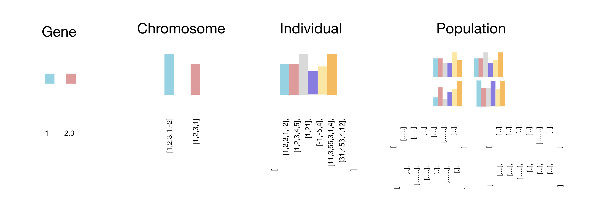
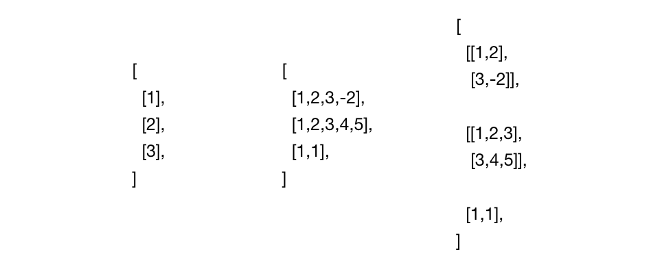
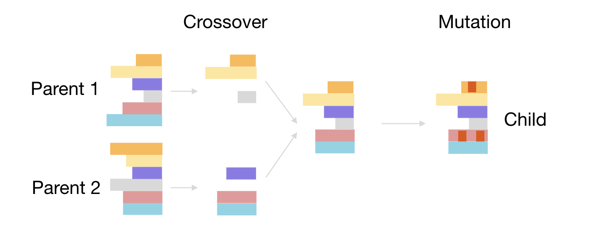
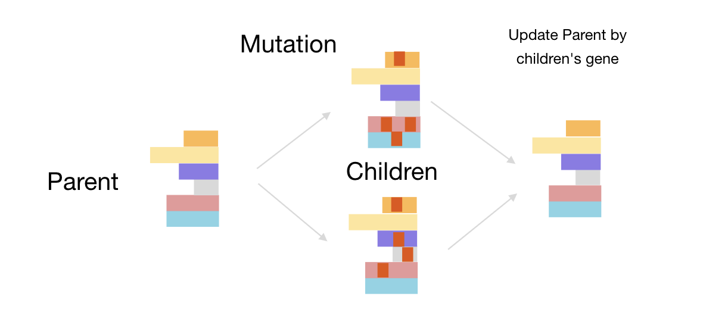

# MEvo

---
[](https://github.com/MorvanZhou/mevo/actions/workflows/python-package.yml)
[](https://github.com/MorvanZhou/mevo/blob/master/LICENSE)

MEvo is a evolutionary algorithm package, which implements Genetic Algorithm and Evolution Strategies Algorithms.
It can be used to form an agent strategy or optimize math problems.

# Quick look

Training a cartpole policy by using Genetic Algorithm.

```python
import mevo
import gymnasium
import numpy as np


# define a fitness function to get fitness for every individual
def fitness_fn(ind: mevo.individuals.Individual, conf: dict) -> float:
    ep_r = 0
    env = gymnasium.make('CartPole-v1')
    env.reset()
    for _ in range(2):
        s, _ = env.reset()
        for _ in range(500):  # in one episode
            logits = ind.predict(s)
            a = np.argmax(logits)
            s, r, done, _, _ = env.step(a)
            ep_r += r
            if done:
                break
    return ep_r


# training
with mevo.GeneticAlgoNet(max_size=20, layer_size=[4, 8, 2], drop_rate=0.7, mutate_rate=0.5) as pop:
    for generation in range(40):
        pop.evolve(fitness_fn=fitness_fn)
        print(f"generation={generation}, top_fitness={pop.top.fitness:.f2}")
```

After only 40 generations in a population (20 individuals), it gives a greate result.
Use following code to visualize the learned policy.

```python
# deploy the best individual
env = gymnasium.make('CartPole-v1', render_mode="human")
while True:
    s, _ = env.reset()
    while True:  # in one episode
        logits = pop.top.predict(s)
        a = np.argmax(logits)
        s, _, done = env.step(a)[:3]
        if done:
            break
```


# What is MEvo

In the MEvo, the smallest data segment is Gene. A set of gene can be packed into a Chromosome.
Chromosomes then formed an Individual. A Population consists of many individuals.



This is different from the classical Genetic Algorithm which their chromosome only consists of a 1D array.
In other words, chromosome in the MEvo is n-D array with different shape.



**Why making data shape varied?**

Because we want to possibly evolve a neural network which has multiple layers in various shape.

MEvo has two different algorithm families.

- Genetic Algorithm family
- Evolution Strategy family

The Genetic Algorithm basically has two steps:

1. crossover the chromosomes in a population
2. mutate gene in new generation

The following image shows how crossover on two parents chromosomes,
and how to mutate the new chromosome.



And MEvo's Evolution Strategy has different two steps:

1. mutate gene (normal distribution) from one single chromosome
2. update this chromosome by all mutated results



# Parallel training

MEvo support parallel training. Simply set `n_worker` > 1 to unlock your machine power for training on multiple cores.
When `n_worker=-1` then use all your cores.

Simply replace the `pop` definition by including `n_worker` from previous code.

```python
# parallel training
if __name__ == "__main__":
    with mevo.GeneticAlgoNet(max_size=20, layer_size=[4, 8, 2], n_worker=-1, drop_rate=0.7, mutate_rate=0.5) as pop:
        for generation in range(40):
            pop.evolve(fitness_fn=fitness_fn)
            print(f"generation={generation}, top_fitness={pop.top.fitness:.2f}")
```

Note that the parallel code must be run under `if __name__ == "__main__"：` scope,
otherwise a python multiprocessing err will occur.

# Methods and Parameters

MEvo support following populations:

- mevo.GeneticAlgoInt()
- mevo.GeneticAlgoFloat()
- mevo.GeneticAlgoOrder()
- mevo.GeneticAlgoNet()
- mevo.EvolutionStrategyNet()

## A classical genetic algorithm problem

such as Travel Sales Problem (TSP) can be solved by following classical Populations:

- mevo.GeneticAlgoInt()
- mevo.GeneticAlgoFloat()
- mevo.GeneticAlgoOrder()

### A Travel Sales Problem example using `pop = mevo.GeneticAlgoOrder()`:

```python
import mevo
import numpy as np

positions = [np.random.rand(2) for _ in range(20)]


def distance_fitness_fn(ind: mevo.individuals.Individual, conf: dict) -> float:
    order = [c.data[0] for c in ind.chromosomes]
    cost = 0
    for i in range(len(order) - 1):
        p1, p2 = positions[order[i]], positions[order[i + 1]]
        cost += np.square(p1 - p2).sum()
    fitness = -cost
    return fitness


pop = mevo.GeneticAlgoOrder(
    max_size=50,
    chromo_size=len(positions),
    drop_rate=0.3,
    mutate_rate=0.01,
)
pop.run(fitness_fn=distance_fitness_fn, step=30)
```

### An optimization problem example using `pop = mevo.GeneticAlgoInt()`:

```python
import mevo
import numpy as np


def wave_fitness_fn(ind: mevo.individuals.Individual, conf: dict) -> float:
    binary = [c.data for c in ind.chromosomes]
    c = np.concatenate(binary, axis=0)
    a = 2 ** np.arange(len(c))[::-1]
    decimal = c.dot(a)

    x = decimal / float(2 ** len(c) - 1) * 5
    o = np.sin(10 * x) * x + np.cos(2 * x) * x
    return o


pop = mevo.GeneticAlgoInt(
    max_size=20,
    chromo_size=10,
    drop_rate=0.3,
    chromo_initializer=mevo.chromosomes.initializers.RandomInt(0, 2),
    mutate_rate=0.01,
)
pop.run(step=20, fitness_fn=wave_fitness_fn)
```

## Deep Net Evolution

For policy learning or Reinforcement learning alternative, the following two methods has their advantages.

- mevo.GeneticAlgoNet()
- mevo.EvolutionStrategyNet()

|              | Reinforcement Learning               | MEvo                                                                                                  |
|--------------|--------------------------------------|-------------------------------------------------------------------------------------------------------|
| Training     | Has forward and backward propagation | Only has forward propagation, but need crossover or mutation operation (lighter than backpropagation) |
| Exploration  | Needs carefully set explore policy   | Different children setting automatically ensure the exploration                                       |
| Memory needs | Can only keep one set of parameters  | In each generation, must compute all children's parameters (parallel computing save time)             |
| Network Size | Generally large and deep net         | With a large scale exploration, a relatively small net can perform a good job                         |

### A `mevo.GeneticAlgoNet()` example:

```python
import mevo
import gymnasium
import numpy as np


def fitness_fn(ind: mevo.individuals.Individual, conf: dict) -> float:
    ep_r = 0
    env = gymnasium.make('Pendulum-v1')
    env.reset(seed=conf["seed"])
    for _ in range(2):
        s, _ = env.reset()
        for _ in range(150):  # in one episode
            logits = ind.predict(s)
            a = np.tanh(logits) * 2
            s, r, _, _, _ = env.step(a)
            ep_r += r
    return ep_r


def train():
    with mevo.GeneticAlgoNet(
            max_size=30,
            layer_size=[3, 32, 1],
            drop_rate=0.7,
            mutate_rate=0.5,
            n_worker=-1,
    ) as pop:
        for ep in range(700):
            pop.evolve(
                fitness_fn=fitness_fn,
            )
            print(ep, pop.top.fitness)
    return pop.top


def show(top):
    env = gymnasium.make('Pendulum-v1', render_mode="human")
    while True:
        s, _ = env.reset()
        for _ in range(200):  # in one episode
            logits = top.predict(s)
            a = np.tanh(logits) * 2
            s, _, _, _, _ = env.step(a)


if __name__ == "__main__":
    top = train()
    show(top)
```

### A `mevo.EvolutionStrategyNet()` example:

```python
import mevo
import gymnasium
import numpy as np


def fitness_fn(ind: mevo.individuals.EvolutionStrategyDense, conf: dict) -> float:
    ep_r = 0
    seed = conf["seed"]
    index = conf["index"]

    env = gymnasium.make('Pendulum-v1')

    # ! must set seed and clone when using mevo.EvolutionStrategyNet()
    env.reset(seed=conf["seed"])
    c_ind = ind.clone_with_mutate(index, seed)
    # ###############

    for _ in range(2):
        s, _ = env.reset()
        for _ in range(100):
            logits = c_ind.predict(s)
            a = np.tanh(logits) * 2
            s, r, _, _, _ = env.step(a)
            ep_r += r
    return ep_r


def train():
    with mevo.EvolutionStrategyNet(
            max_size=15,
            layer_size=[3, 32, 1],
            mutate_strength=0.05,
            learning_rate=0.1,
            n_worker=-1,
            seed=2
    ) as pop:
        for ep in range(700):
            pop.evolve(fitness_fn=fitness_fn)
            print(ep, pop.top.fitness)
    return pop.top


def show(top):
    env = gymnasium.make(
        'Pendulum-v1',
        render_mode="human"
    )
    while True:
        s, _ = env.reset()
        for _ in range(200):  # in one episode
            logits = top.predict(s)
            a = np.tanh(logits) * 2
            s, _, _, _, _ = env.step(a)


if __name__ == "__main__":
    top = train()
    show(top)
```
